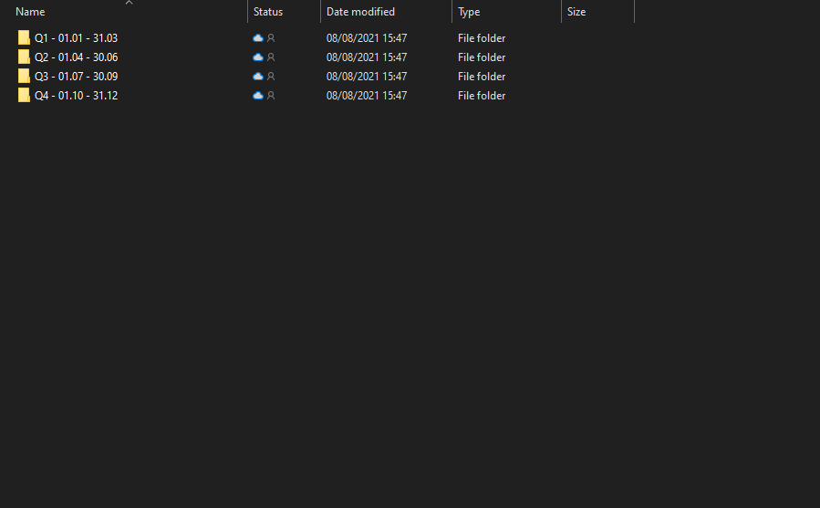

# Factures/notes de crédit des Achats

Lorsqu'une nouvelle facture est reçue, que ce soit par courrier ou par e-mail, elle est enregistrée dans le OneDrive dans le fichier suivant: `Comptabilité/%{ANNÉE}/%{TRIMESTRE}/À PAYER`

* `%{ANNÉE}` : **Année de la date de facture**
* `%{TRIMESTRE}` : FrëschKëscht doit soumettre une déclaration de TVA chaque trimestre, donc l'année est divisée en 4 trimestres différents : **Q1, Q2, Q3 et Q4.** La facture doit être enregistrée dans le trimestre dans lequel la date de la facture est dans la période d'un trimestre.  _**Exemple** : Nous avons reçu une facture d'Amazon le **30 juin** \(la date de la facture est toujours écrit sur la facture\), elle sera ensuite enregistrée au deuxième trimestre \(Q2\) dans le fichier "**À payer"**_

| Trimestre | Periode |
| :--- | :--- |
| Q1 \(trimestre 1\) | 01.01 - 31.03 |
| Q2 \(trimestre 2\) | 01.04 - 30.06 |
| Q3 \(trimestre 3\) | 01.07 - 30.09 |
| Q4 \(trimestre 4\) | 01.10 - 31.12 |

